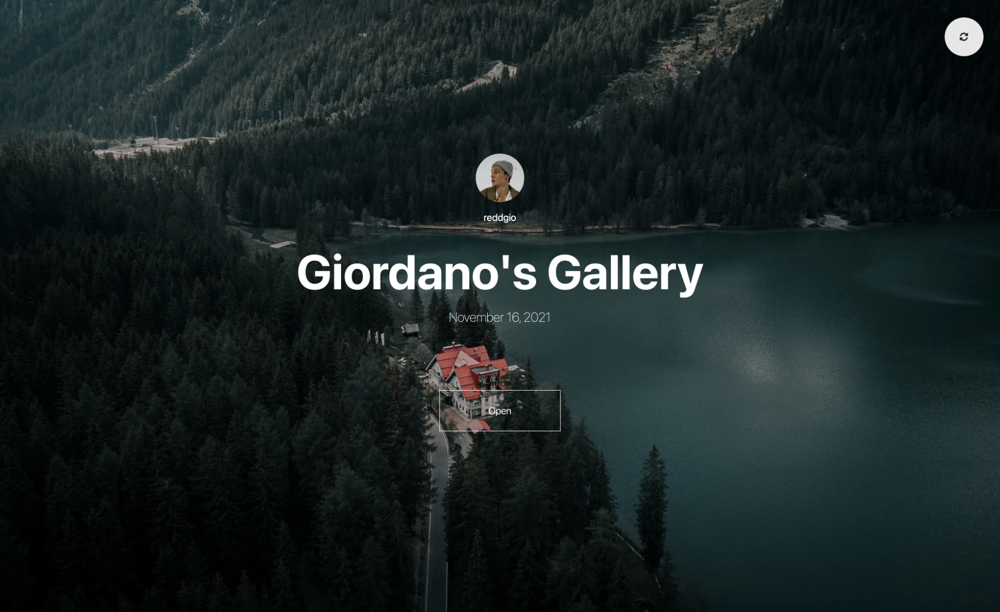

# Responsive Gallery
### [Click Here for the Live Site!](https://responsive-gallery-chi.vercel.app)
- Created using Unsplash API to generate a unique gallery for a user upon every load
- Used Masonry to create a moziac of photos that displays number of columns based on the size of a device
- Focused on creating a beautiful user experience with images

## Why This Project?
As a photographer myself, I have to find ways to share my finished photos with my clients. The most accessible option is some form of cloud drive service such as Google Drive or Dropbox. Although these solutions get the job done, they do not project your brand and identity in a professional manner, as you are relying on third-party services to share your polished, finished photos on. The experience of looking at the photos on these platforms does not feel unique. It just feels like a way to give your photos out.

I wanted to find a way to share photos in a beautiful way that feels special to each person that receives them. I drew inspiration from [Pixieset](https://pixieset.com), that allows you to do this, however I wanted an open source, reusable version for my own use, and anyone else wishing for such a product. I created this web app using Next.js for the easily accessible backend api and the built-in image optimizations that work even better when deployed on Vercel. I used the Unsplash Production API to deliver photos for endless scrolling of galleries of unique portfolios and galleries (all with credits and links to their profiles and images on Unsplash).

## Running Locally
First, install the dependencies with:
```bash
npm install
```

Then, run the development server:

```bash
npm run dev
```

Open [http://localhost:3000](http://localhost:3000) with your browser to see the result.



